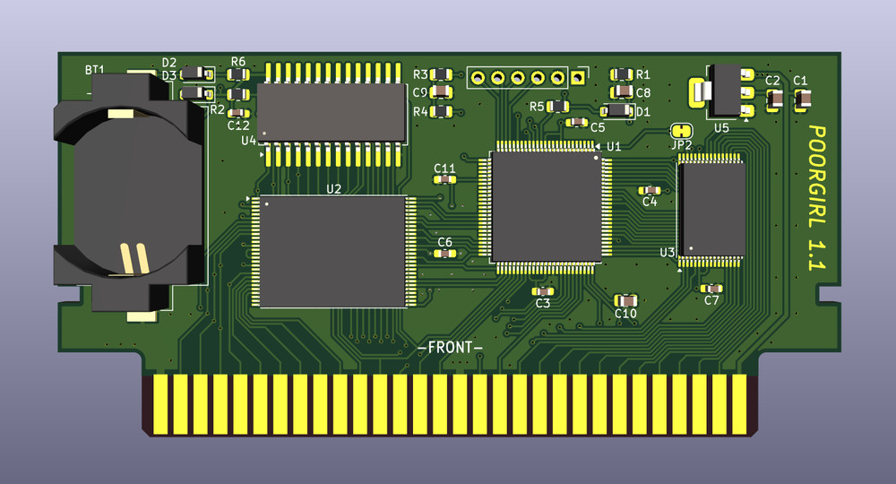

### POORGIRL - дешевый картридж-многоигровка для Famicom/Dendy

Данный проект является компиляцией [COOLGIRL](https://github.com/ClusterM/coolgirl-famicom-multicart) **Алексея Clustera** и китайских флэшкартриджей. Допускается установка **EPM570T100** или **EPM240T100**, но учтите, что в EPM240 влезет небольшое количество мапперов из-за малого объема логических ячеек. Картридж поддерживает сохранение только одной игры, если вы запустите другую игру с поддержкой сохранений, то записи от предыдущей игры пропадут.  
  
Характеристики:  
* PRG ROM: max 128 MiB
* CHR RAM: max 256 KiB
* PRG RAM: 32 KiB, FRAM или SRAM с батарейкой

### Сборка

#### BoM и Schematic
[BoM](PoorGirl-Docs/PoorGirl1.1-BOM.jpg)  
  
[Schematic](PoorGirl-Docs/PoorGirl1.1-Schematic.pdf)

Элементы **R1, D1, C8** нужны только для software reset, по умолчанию в прошивке он отключен.  
Элементы **BT1, D2, D3, R6** нужны для питания SRAM, если предполагается установка FRAM, то достаточно запаять перемычку **"FRAM"**.  
Если вы используете EPM570T100, то замкните две перемычки **"EPM570 ONLY"** на обратной стороне платы.

#### PCB

* Layers: 2
* PCB Thickness: 1.2mm
* Рекомендуется ENIG покрытие
  

#### Firmware
В архиве **PoorGirl-Firmware/PoorGirl-Firmware.zip** находятся проекты для Quartus. Все мапперы не влезут в EPM570T100 (тем более в EPM240T100), поэтому выберите нужные в начале файла с verilog кодом **Cool2Poor.v**, чтобы они поместились в 570 (240) логических ячеек.  
По умолчанию reset отключен, поэтому при сбросе приставки появится начальный экран текущей игры, а не меню. Для **включения reset** измените значение `parameter RESET_COMBINATION = 8'b0` на `8'b11010010`, но учтите, что reset занимает около 80 логических ячеек.  
Оптимизированные прошивки можно найти на [форуме Emu-Land.net](https://www.emu-land.net/forum/index.php/topic,82545.0.html), но нужно будет изменить назначения выводов в **Quartus Pin Planner**.

#### Сборка ROM
Для сборки многоигровки с меню можно использовать [COOLGIRL Multirom Builder](https://github.com/ClusterM/coolgirl-multirom-builder). Чтобы работали сохранения, замените файл **saves.asm** на [PoorGirl-Docs/saves.asm](PoorGirl-Docs/saves.asm). Для записи можно использовать [Famicom/NES Dumper/Writer](https://github.com/ClusterM/famicom-dumper-writer), или программатор.
